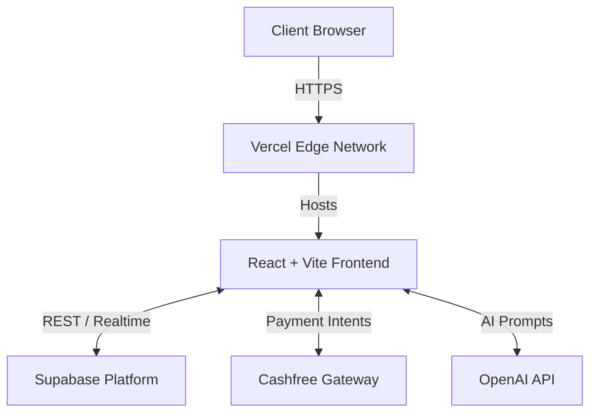
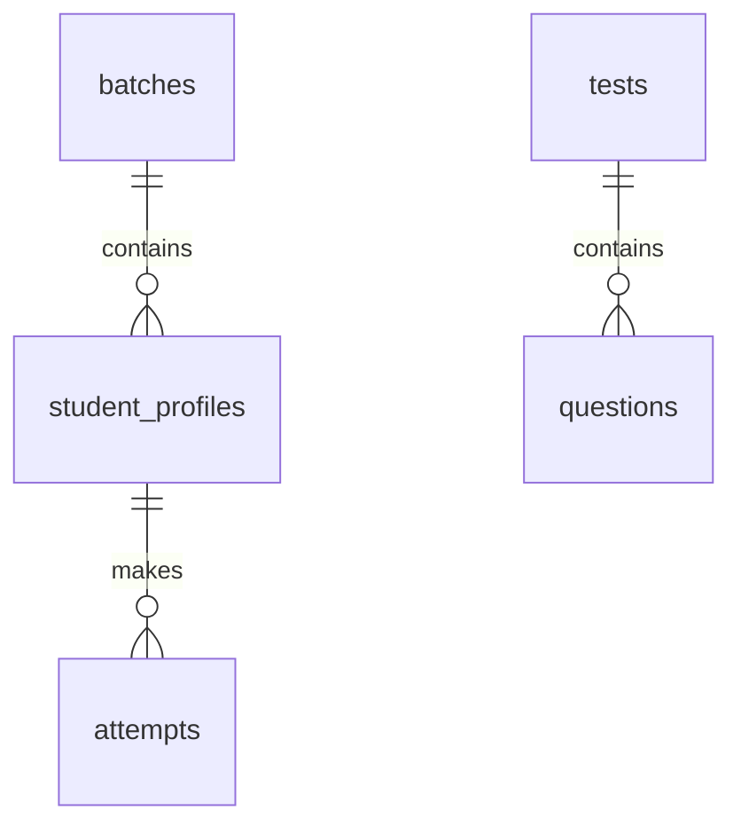

# PrepEntrance — Your Complete AI Exam Prep Partner

PrepEntrance is a next-generation EdTech platform designed specifically for students preparing for highly competitive Indian entrance examinations: **JEE (Main & Advanced)**, **NEET**, and **CUET**. Powered by AI, it delivers personalized study materials, dynamic practice sessions, and intelligent performance tracking.

## Vision & Mission

**Vision:** To democratize top-tier competitive exam preparation by providing every student with a personalized AI mentor that adapts to their learning pace, strengths, and weaknesses.

**Mission:** To build an all-in-one ecosystem that eliminates the need for fragmented study resources, replacing them with a highly structured, data-driven, and engaging learning experience.

---

## Features

- 🧠 **AI-Powered Learning:** The Knowledge Engine processes YouTube lecture videos and generates comprehensive, structured notes and flashcards on the fly.
- 📝 **Practice Center:** Infinite, non-repeating practice questions categorized by subject, chapter, and difficulty level.
- 📋 **Tests:** Full-length mock tests and chapter-wise assessments mimicking real exam environments.
- 🔄 **Revision:** Auto-generated 1-Page Notes, Formula Sheets, and "Must-Do" topics tailored for rapid revision.
- 🏠 **Student Hub:** A centralized dashboard displaying the 21-Day Master Plan, recent activity, and quick navigation.
- 🔒 **Authentication:** Secure Google OAuth and Email/Password login powered by Supabase.
- 🏫 **Batch Management:** Cohort-based learning allowing students to join specific batches (e.g., Aarambh 2028).

---

## Architecture Diagram



## Database Schema Overview


*(For a detailed diagram, see `docs/DATABASE.md`)*

---

## Tech Stack

- **Frontend:** React 18, Vite, TypeScript
- **Styling:** Tailwind CSS, Shadcn UI
- **Backend/Database:** Supabase (PostgreSQL, GoTrue Auth)
- **AI Integrations:** OpenAI (GPT-4)
- **Payments:** Cashfree Payments SDK
- **Icons:** Lucide React

---

## Folder Structure

```text
PrepEntrance/
├── .github/                  # CI/CD Workflows
├── docs/                     # Extensive Developer Documentation
├── src/
│   ├── components/           # Reusable UI components (layout, practice, landing)
│   ├── contexts/             # React Contexts (Auth, ExamMode)
│   ├── data/                 # JSON question banks, offline data
│   ├── hooks/                # Custom React Hooks
│   ├── pages/                # High-level route components
│   └── services/             # API services and logic (Question generators, etc.)
├── .env.example              # Environment variables template
├── package.json
└── README.md
```

---

## Environment Variables

When deploying or running locally, ensure the following environment variables are securely stored in your `.env.local` or hosting provider:

```
VITE_SUPABASE_URL=
VITE_SUPABASE_PUBLISHABLE_KEY=
VITE_CASHFREE_APP_ID=
VITE_CASHFREE_SECRET_KEY=
VITE_OPENAI_API_KEY=
VITE_ENV=
```

---

## Local Development Setup

1. **Clone the repository:**
   ```bash
   git clone https://github.com/ayush12182/setu-prepai.git
   cd setu-prepai
   ```

2. **Install dependencies:**
   ```bash
   npm install
   ```

3. **Configure Environment Variables:**
   ```bash
   cp .env.example .env.local
   ```
   Fill in your Supabase, Cashfree, and OpenAI keys in `.env.local`.

4. **Start the Development Server:**
   ```bash
   npm run dev
   ```

*(See `docs/ENVIRONMENT_SETUP.md` for full details.)*

---

## Deployment

PrepEntrance uses **Vercel** for hosting the frontend and **Supabase** for the backend database. 

Our CI/CD pipeline enforces:
- Pushes to the `testing` branch automatically deploy to a Preview environment.
- Pushes to the `main` branch automatically deploy to the Production environment.

*(See `docs/DEPLOYMENT.md` for full details.)*

---

## Testing Workflow

We strictly separate production data from QA data.
All new features must be developed on `feature/*` branches and merged into the `testing` branch first. After passing QA in the sandbox environment, changes are merged into `main`.

*(See `docs/TESTING.md` for full details.)*

---

## Known Limitations

- **Knowledge Engine Video Length:** Currently struggles to process YouTube videos longer than 3 hours due to token limitations.
- **Offline Question Bank:** If the AI backend is unreachable, the fallback question bank is limited in size for niche topics.

---

## Roadmap

- [ ] Launch full Performance Analytics Dashboard.
- [ ] Implement AI Doubt Solver (Ask PrepEntrance).
- [ ] Add mobile application wrap (React Native/Capacitor).
- [ ] Support regional languages for state-level exams.

---

## License

This project is licensed under the MIT License - see the [LICENSE](LICENSE) file for details.
