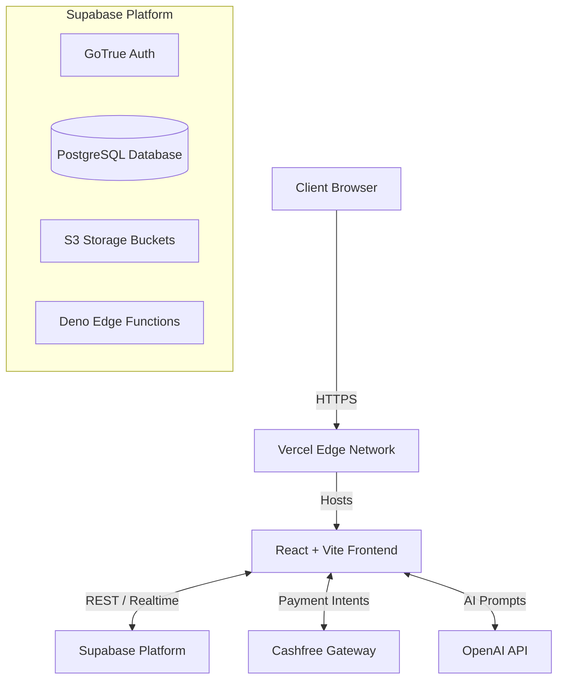

# Architecture Overview

PrepEntrance is a modern, modular React web application built for high performance and AI integration.

## Architecture Diagram

## Frontend
- **Framework**: React 18 powered by Vite.
- **Routing**: React Router DOM for client-side navigation.
- **State Management**: Zustand and Context API.
- **Styling**: Tailwind CSS + Shadcn UI components.
- **Build**: TypeScript compiler for strict type-safety.

## Backend & Database
We use **Supabase** as our complete backend-as-a-service (BaaS).
- **PostgreSQL**: Stores all relational data.
- **Row Level Security (RLS)**: Enforces permissions directly at the database level so clients can securely query data without an intermediate server.

## Authentication
- Handled by Supabase Auth (GoTrue).
- Supports Email/Password and OAuth (Google).
- JWTs are automatically managed and attached to database requests by the Supabase JS client.

## AI Flow
1. User submits a request (e.g., analyze YouTube video, ask a doubt).
2. Frontend constructs a highly structured prompt using internal context.
3. Frontend queries the OpenAI API.
4. Response is streamed back to the user or parsed into structured JSON components (like Flashcards or Notes).

## Deployment
- Hosted on Vercel.
- Edge caching enabled for static assets.
- CI/CD automatically manages preview and production builds.
