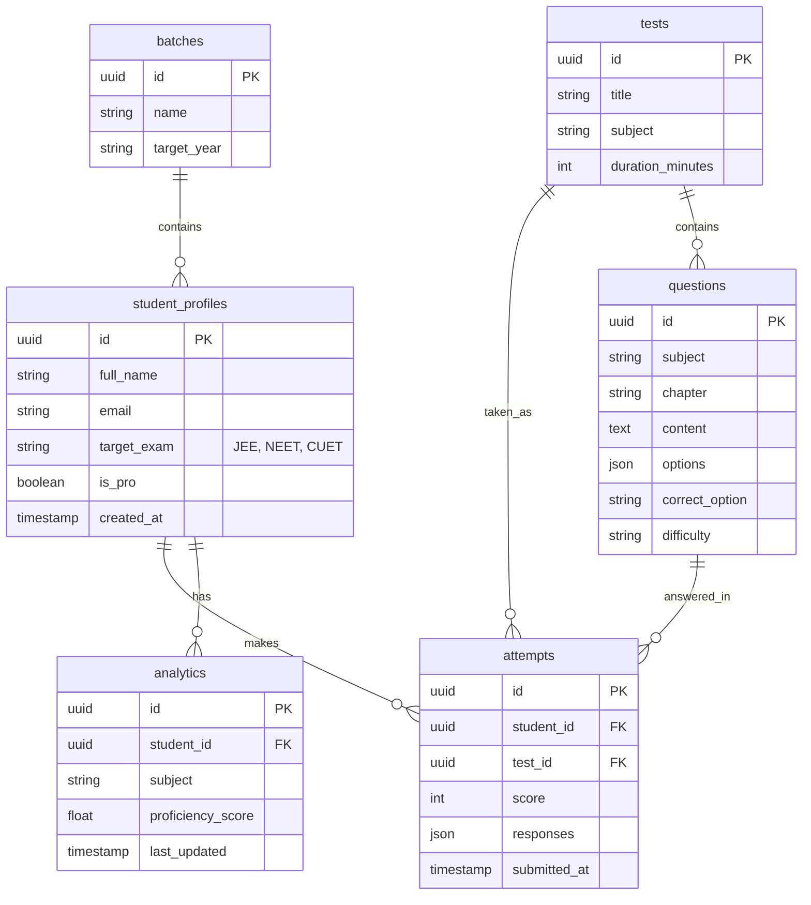

# Database Schema

PrepEntrance uses a PostgreSQL database hosted on Supabase.

## Entity Relationship Diagram

## Security
- **Row Level Security (RLS)** is enabled on all tables.
- Students can only `SELECT`, `UPDATE`, or `INSERT` rows where `student_id = auth.uid()`.
- `questions` and `tests` are publicly readable but only writable by admins.
